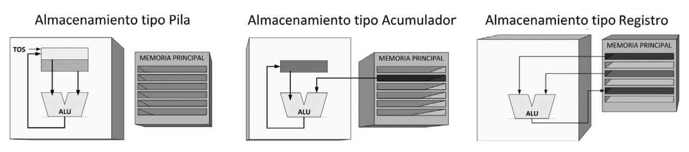

# Informe de Investigación Sobre Arquitectura de Computadoras

Electronica IV - Trabajo Práctico Nº2 - Arquitectura de Computadoras

Facundo Sonzogni

## Introducción

Una ***Computadora*** es una Máquina (electrónica y digital), que es capaz de realizar varias tareas, ejecutando una serie de instrucciones provenientes de un Programa, a través de una *Unidad Central de Procesamiento* que recibe datos de entrada, los cuales traslada, almacena y procesa para convertirlos en información que posteriormente se envía a los puertos de salida. Además una computadora puede Cambiar de programa (es decir, si se cambian las instrucciones, la computadora cambia de tarea).
La anterior NO es una definición rigurosa de una Computadora, pero es suficiente para comprender su funcioamiento y cuáles son los elementos básicos de la misma, que se exponen en secciones siguientes. 

### Arquitectura de Computadoras

Hasta este punto, se ha discutido brevemente principal funcionamiento de una computadora. Sin embargo, debemos notar que hay diferentes maneras de realizar la interconexión del hardware de una computadora,las cuales dependerán de su funcionalidad, de su eficiencia y de los costos. Luego, es preciso distinguir entre las distintas maneras en las que puede estar constituído internamente un sistema de cómputo y realizar MODELOS que permitan estudiar como interactúa la CPU con los elementos de memoria; Estos modelos constituyen lo que llamamos ***Arquitectura de Computadoras***.

Establecer una única definición para lo que entendemos por "Arquitectura de una Computadora" resulta una tarea complicada, por varios motivos. En primera instancia, debido a la gran variedad de sistemas que hoy en día se agrupan en la denominación “computadora”; por otro lado, debido al ritmo vertiginoso al que cambian todos estos sistemas, tanto en lo que se refiere a la tecnología como al diseño, y la complejidad de las técnicas empleadas en la actualidad (Beltrán, Guzmán). A continuación se citan algunas definiciones dadas por diversos autores:

- *“Es la estructura de una computadora que debe conocer un programador en lenguaje máquina para escribir programas correctos para esa máquina”* (Familia 360 de IBM).
- *“Son los atributos de una computadora tal y como los ve un programador en lenguaje ensamblador, comprende la estructura conceptual y el modelo funcional (modelo de programación)”* (Amdhal, Blaaw y Brooks en 1964).
- *“Computer architecture refers to those attributes of a system visible to a programmer or, put another way, those attributes that have a direct impact on the logical execution of a program”* (Stallings William).
- *“The architecture is the programmer’s view of a computer. It is defined by the instruction set (language), and operand locations (registers and memory)”* (Harris, Harris).
- *“La arquitectura de computadoras, también llamada arquitectura de ordenadores en algunos casos, es el diseño conceptual y la estructura operacional fundamental de un sistema de computadoras.​ Es decir, es un modelo y una descripción funcional de los requerimientos y las implementaciones de diseño para varias partes de una computadora, con especial interés en la forma en que la unidad central de proceso (CPU) trabaja internamente y accede a las direcciones de memoria.”* (Wikipedia).

A partir de estas definiciones (y de muchas otras), se observa que en todos los casos, la arquitectura de computadoras se basa en una descomposición de la computadora en diferentes niveles que den una idea de su descricpción jerárquica. Luego, dependiendo de cuál sea la descomposición que se realice, se tendrá una descripción diferente de la máquina, lo cual se traduce en que cada arquitectura tendrá sus reglas de diseño, sus leyes de funcionamiento y su lenguaje de representación. Se trata, entonces, de una materia estrechamente
relacionada con el estudio de la estructura y organización de la computadora y con las relaciones entre
sus componentes. (Beltrán, Guzmán).
Así, es importante conocer la arquitectura de una computadora para comprender como se debe programar un determinado microprocesador. Asímismo, si se desea diseñar una computadora, se debe tener en cuenta su finalidad para poder elegir la arquitectura más adecuada.

---------------------------------------------------------------------------------------------------------------

Al realizar la descripción de una computadora, usualmente es necesario realizar una distinción entre lo referido a su **Arquitectura**, de lo que relacionado a su **Microarquitectura** (u Organización). Además, ambos conceptos deben distinguirse del **Software** de la computadora: 

El concepto de *Arquitectura de Computadoras* se relaciona con el coportamineto funcional de un sistema de computación que son VISIBLES PARA EL PROGRAMADOR, que inclue aspectos como el tamaño de los diferentes tipos de datos, los tipos de operaciones que se pueden realizar, los formatos de instrucciones, los registros y fundamentalmente, el acceso de la CPU a la memoria de datos y la memoria de instrucciones. En cambio, la *Microarquitectura de Computadoras* se refiera a las relaciones estructurales que NO SON VISIBLES AL PROGRAMADOR, como el arreglo específico de registros, memorias y ALU's del CPU, las interfaces hacia los dispositivos periféricos, la frecuencia de reloj, entre otros. (Un ejemplo sencillo para comprender esta diferencia podría ser el siguiente: Decidir si un procesador tendrá la opción de realizar una instrucción de una multiplicación está relacionado con su Arquitectura, mientras que es un problema de Organización (o mircroarquitectura) el determinar el mecanismo o la forma mediante el cual el procesador realizará la multiplicación). Esta distinción es muy importante puesto que muchos diseñadores de computadoras ofrecen máquinas que poseen la misma arquitecura, pero una organización diferente, que poseen diferentes atributos. (Stallings W.) (Harris, Harris) (Murdocca)
En contraposición, el *Software de una Computadora* abarca todo lo intangible relacionado con el funcionamiento de la máquina y es, finalmente, lo que permite que el hardware realice una tarea útil. El Estándar 729 de IEEE define el Software como el conjunto de los programas de cómputo, procedimientos, reglas, documentación y datos asociados, que forman parte de las operaciones de un sistema de computación. Las dos categorías principales de software usado
en una computadora son:
 - *Software del Sistema:* Constituye el Sistema Operativo y es lo que permite que el Usuario interactúe con la computadora: Se encarga de a) gestionar todo el hardware y el software de aplicación dentro de una computadora y b)Proporcionar una interfaz coherente entre el software de aplicación y el hardware. (Floyd)
 - *Software de Aplicación:* Se utiliza para realizar una tarea o trabajo específico. Para cada aplicación de una computadora, se debe diseñar un software que interaccione con el hardware para realizar alguna función.
Es importante notar que la Arquitectura de Computadoras no sólo se encarga de los elementos hardware sino también de los elementos software. Esto se debe a que en muchos casos ambos aspectos se hallan estrechamente relacionados y no se pueden estudiar por separado. (Beltrán, Guzmán).

## Clases de arquitectura de computadora

Hasta ahora, se ha discutido el concepto de Arquitectura de computadoras. En los siguientes párrafos se hará mayor hincapié en las distintas maneras en las que se puede diseñar una máquina en función de su arquitectura: Destacan, principalmente, 3 tipos de arquitecturas, basadas en el tipo de memoria que emplea la computadora: *Máquina de Pila*, *Máquina de Acumulador* y *Máquina de Registros*, las cuales se exponen brevemente a continuación:

**1) Máquina de Pila:** Una *Pila* es una lista ordenada o estructura de datos que permite almacenar y recuperar datos, siendo el modo de acceso a sus elementos de tipo LIFO (del inglés *Last In, First Out*). Cuando una máquina emplea una pila como principal método de almacenamiento se denomina "Máquina de Pila" y se caracteriza por que los operandos son implícitos, ubicados siempre en la parte superior de la pila (*Top of Stack, TOS*). Es decir, no es necesario indicar en las instrucciones dónde se encuentran los operandos. (Beltrán, Guzmán).

Como principales ventajas de este tipo de Arquitecturas podemos mencionar su sencillez para evaluar de expresiones y que posee instrucciones cortas que pueden brindar una buena densidad de código. En contrapartida, las desventajas más claras de estas máquinas radican en el hecho de que NO se puede acceder a cualquier elemento de memoria de manera aleatoria, pues los operandos son siempre los de la parte superior de la pila, lo cual dificulta la implementación de un código eficiente. (Beltrán, Guzmán).

**2) Máquina de Acumulador:** Una Máquina que emplea como memoria principal a un *Acumulador* revibe el nombre de "Máquina de Acumulador" y se caracteriza por el hecho de que uno de los operandos siempre es implícito (el que está en el acumulador) y el otro se debe especificar de manera explícita, a diferencia de la pila en la que ambos operandos están implicitos. Es decir, solo se debe dar la instrucción de donde se encuentra uno de los operandos que ingresan a la ALU.

La ventaja más notaria de este tipo de Arquitectura es su simplicidad, pues requiere de pocas instrucciones y además cortas, debido a que uno de los operandos siempre es el del Acumulador. Sin embargo, como el acumulador es solamente almacenamiento temporal, el tráfico de memoria es el más alto en esta aproximación. Además, dificulta la implementación de un código eficiente pues requiere de instrucciones especiales para transferir datos entre registros y memoria (Beltrán, Guzman)

**3) Máquina de Regsitros:** Un *Registro* es un circuito digital con dos funciones básicas: almacenamiento de datos y movimiento de datos. Una máquina que emplea un Registro como memoria principal recibe el nombre de "Máquina de Registro". Su principal característica es que los operandos se especifican de manera explícita; pueden ser dos operandos (si uno de los operandos fuente almacena también el resultado de la operación) o tres operandos. Además, se puede permitir que alguno o todos los operandos se encuentren en memoria.
Casi todas las arquitecturas actuales se basan en registros de propósito general ya que los registros son más rápidos que otros tipos de almacenamiento, sobre todo que la memoria (porque están dentro del propio procesador).

Sus ventajas radican en que el acceso a los datos es más rápido y eficiente, debido a la posibilidad de acceder aleatoriamente a las casillas de memoria, lo cual reduce el tráfico hacia la memoria y permite la implementación de un código más eficiente. Como posibles desventajas se podría mencionar que requiere, en muchas ocasiones, de un gran número de registros (Una computadora tiene 32 registros, como estándar), y que se deben especificar explícitamente todos los operandos de la ALU.

- A continuación, se exponen imágenes en las que se ilustra el funcionamiento básico de los 3 tipos de máquinas descriptos

------------------------------------------------------------------------------------------------------------------------------------------------

Por otro lado, también es posible realiar una clasificiación de las arquitecturas de computadoras en función de la *Complejidad de la Instrucciones*. Principalmente, se distingue entre la Arquitectura **CISC** (*Complex Instruction Set Computer*), en las cuales los procesadores ejecutan pocas instrucciones, pero complicadas, en contraposición con la Arquitectura **RISC** (*Reduced Instruction Set Computer*), caracterizada por implementar muchas instrucciones pero sencillas:

Antiguamente, los tiempos de ciclos de memoria eran mucho más largos que en la actualidad (además, las memorias eran más costosas), por lo que era preferible incluir programas con pocas instrucciones complejas por sobre un programa con una mayor cantidad de instrucciones por más simples que sean (Murdocca, 408); Es decir, la mayoría de las máquinas tenían una Arquitectura **CISC**. Sin embargo, con el tiempo las memorias se abarataron y se hicieron más veloces, a la vez que se desarrolló una tecnología de *Pipelining* (que permitía que las diferentes instrucciones, cada una de las cuales requiere varios ciclos de reloj, utilicen distintas partes de la undidad de ejecución en cada ciclo de reloj. Así, mientras se decodifica una instrucción, otra instrucción podría estar usando la ALU, simultáneamente). Este tipo de tecnología NO encajaba muy bien con las instrucciones complejas de una arquitectura CISC, por lo que se empezaron a implementar arquitecturas en las que se ejecutaban instruccione smás sencillas, dando naciemiento a la Arquitectura **RISC**.

***Ventajas y Desventajas de las Arquitecturas CISC y RISC***

Como ya se explicó, en el tipo de arquitectura **CISC** las instrucciones están, generalmente, fomradas por varios bytes, lo quedificulta el paralelismo entre instrucciones, Sin embargo, ello implica que cada instrucción realiza varias tareas al mismo tiempo, por lo que la mayoría de los sistemas CISC son de alto rendimiento.

Por otro lado, la arquitectura **RISC** se centra en obtener procesadores con las siguientes características:
  - Todas las instrucciones son de longitud fija, cuyo tamaño es una palabra.
  - Todas la instrucciones ejecutan operaciones simples que pueden llevarse hacia la estrutura segmentada (*pipelined*) a razón de una instrucción por ciclo de reloj.
  - Todos los operandos deben estar almacenados en registros ANTES de que se pueda operar sobre ellos.
  - Existe un conjunto separado de instrucciones para acceder a la memoria: *LOAD* y *STORE*, que permiten cargar y almacenar datos en la memoria. (Murdocca).
Este tipo de arquitecturas permiten el paralelismo de instrucciones. Además, la CPU puede estar ejecutando una instrucción, almacenando sus resultados y simultáneamente estar en la búsqueda en memoria de la siguiente instrucción a ejecutar. Con ello, se reducen los tiempos de acceso a memoria y los tiempos de ejecución.

**OBSERVACIÓN:** Uno podría estar tentado a pensar que en vista de las ventajas de velocidad de la tecnología RISC, las máquinas CISC de la época habrían salido del mercado, pero esto NO fue así. En primer lugar, la mayoría de las computadoras hasta ese momento tenían arquitectura CISC, por lo que si las nuevas tecnologías fueran del mismo tipo, estaría garantizada la compatibilidad entre lo existente con los nuevo. En segundo lugar, empresas como INTEL lograron aplicar las mismas ideas incluyendo un núcleo RISC para ejcutar instrucciones más simples y las más comunes, al mismo tiempo que la CPU interpreta las instrucciones más complejas de la forma CISC acostumbradas. De esta manera se consigue que las instrucciones más comunes se ejecuten rápidamente, mientras que las instrucciones menos comunes sean más lentas. Este modelo híbrido NO es tan rápido como un modelo RISC puro, pero ofreció un diseño global suficientemente competitivo y permitió la ejecución del software viejo sin modificaciones (Tanenbaum, 47).

------------------------------------------------------------------------------------------------------------------------------------------------

Con todo lo anterior en mente, estamos en condiciones de profundizar en los Modelos de Arquitecturas de Computadoras más reconocidos, los cuáles son, seguramente: ***La Arquitectura Von Neumann*** y la ***Arquitectura Harvard***, las cuales se explican brevemente a continuación:

**1) Arquitectura Von Neumann:** El modelo de Arquitectura Von Neumann es aquel que está basado en la descripta por el físico húngaro John Von Neumman. Este modelo cuenta de 4 elementos principalmente, como se muestra en la siguiente imagen

  *1. Dispositivos de Entrada:* Estos son los encargados de proveer las instrucciones y los datos requeridos por el sistema.
  
  *2. Memoria Principal:* Los datos Y las instrucciones se alamecenan en una memoria principal a la cual puede acceder la CPU a través de un bus.
  
  *3. Unidad Central de Procesamiento (CPU):* Constituída por una ALU que procesa los datos e Intrucciones, bajo la dirección de una Unidad de Control.
  
  *4. Dispositivos de Salida:* Los resultados obtenidos luego del procesamiento se envían a los dispositivos de salida. (Murdocca).

Este tipo de Arquitectura está caracterizado por un atributo fundamental: Se accede a la Memoria de DATOS y a la Memoria de INSTRUCCIONES a través de un ***mismo bus***. Es decir, NO necesariamente debe haber una única memoria para ambos (datos e instrucciones), sino que al procesador le llegan los bits corresponidentes por un un Mismo Bus (Bus de Datos e Instrucciones).
En la mayoría de los casos, una única memoria central almacena palabras binarias que pueden representar en forma indistinta instrucciones, datos u operandos (Esto es el concepto de *Programa Almacenado*) y el procesador puede acceder indiscriminadamente a cualquiera de ellos.

En conclusión, una buena manera de determinar si una computadora es una máquina de arquitectura Von Neumann es verificar que cumpla con lo siguiente:
  1. Tanto los programas como los datos se almacenan en una memoria en común. Esto hace posible la ejecución de comandos de la misma forma que los datos.
  2. Cada celda de memoria de la máquina se identifica con un número único, llamado dirección.
  3. Las diferentes partes de la información (los comandos y los datos) tienen diferentes modos de uso, pero la estructura no se representa en memoria de manera codificada.
  4. Cada programa se ejecuta de forma secuencial que, en el caso de que no haya instrucciones especiales, comienza con la primera instrucción. Para cambiar esta secuencia se utiliza el comando de control de transferencia. (Wikipedia).

**2) Arquitectura Harvard:** El modelo de Arquitectura Harvard es aquel basado en la computadora Harvard Mark I. Este modelo cuenta de 5 elementos principalmente, como se muestra en la siguiente imagen

  *1. Dispositivos de Entrada:* Estos son los encargados de proveer las instrucciones y los datos requeridos por el sistema.
  
  *2. Memoria de Datos:* Los datos que se deban almacenar y transportar (generalmente una memoria RAM) se encuentran en una memoria de datos, a la cual puede acceder la CPU a través de un bus (bus de datos).

  *3. Memoria de Instrucciones:* Las instrucciones dadas por el programa se encuentran en una memoria de instrucciones (generalmente una memoria FLASH) , a la cual puede acceder la CPU a través de un bus (bus de instrucciones).
  
  *4. Unidad Central de Procesamiento (CPU):* Constituída por una ALU que procesa los datos e Intrucciones, bajo la dirección de una Unidad de Control.
  
  *5. Dispositivos de Salida:* Los resultados obtenidos luego del procesamiento se envían a los dispositivos de salida. 

Este tipo de Arquitectura está caracterizado por un atributo fundamental: Se accede a la Memoria de DATOS y a la Memoria de INSTRUCCIONES a través de ***buses diferentes***. Es decir, En este tipo de computadoras, existen dos bancos de memoria perfectamente diferenciados. El banco de memoria de programa (isntrucciones) y el banco de memoria de datos. Las computadoras que responden a esta arquitectura, tienen distintas formas de conexión con la unidad aritmético lógica, y (normalmente) distintas instrucciones para dirigirse a uno u otro banco de memoria.

***Ventajas y Desventajas de las Arquitecturas Harvard y Von Neumann***

- En primera instancia, la diferencia más evidente entre ambos es que en arquitectura de von Neumann, se utiliza una única memoria (generalmente), para los datos y para el programa, por lo que implica un uso más eficiente de la memoria en comparación con la Arquitectura Harvard.
- Por el mismo motivo, en una Arquitectura Von Neumann la CPU puede estar bien leyendo una instrucción o leyendo/escribiendo datos desde/hacia la memoria pero ambos procesos no pueden ocurrir al mismo tiempo, ya que las instrucciones y datos usan el mismo sistema de buses. Por el contrario, como en una Arquitectura Harvard, los datos y las instrucciones van por buses separados, SÍ se pueden hacer ambas cosas al mismo tiempo, lo que hace que éstas sean más eficientes (temporalmente)
- Como en una Arquitectura Von Neumann, los datos y el programa comparten el mismo bus, hay cierta ambigüedad entre los datos del bus (no se pueden diferenciar), lo cuál NO ocurre en una Arquitectura Harvard.
- Adicionalmente, al tener un único bus, en una Arquitectura Von Neumann, si la instrucción ocupa más de un byte, tendrá que hacer varias lecturas en la memoria, lo que implica que usa más ciclos de reloj.
- Como otra desventaja de la Arquitectura Harvard se puede mencionar que se deben realizar instrucciones especiales para acceder a tablas de valores constantes que puedan ser necesarios de incluir en los programas, pues se encontrarían físicamente en la memoria del programa y NO en la memoria RAM.

------------------------------------------------------------------------------------------------------------------------------------------------

### La Arquitectura ARMv7-M

La Arquitectura ARM es posiblemente la más utilizada en procesadores embebidos. Se utiliza en teléfonos móviles, iPods, equipos de sensores remotos y muchos otros dispositivos. Original, las siglas ARM significaban "Acorn RISC Machine", pero con el tiempo, su significado se tradujo a "*Advanced RISC Machine*", pues se trata escencialmente de un Set de Intruscciones **RISC**. (Hennessy Patterson). Los chips ARM son procesadores de alta velocidad, reconocidos por su pequeño tamaño de matriz y sus bajas exigencias energéticas.

El set de Instrucciones ARM está diseñado para una implementación eficiente del procesador. Todas las instrucciones son de 32 bits. Un añadido de la arquitectura ARM es el set de instrucciones "*Thumb*", que constituye un "sub-set" del set ARM diseñado para mejorar el rendimiento en implementaciones que usan un bus de datos de 16 bits. (Stallings W.)
Si bien ARM cuenta con licencias de varios microprocesadores, los más reconocidos son los de la familia *Cortex*, que incluye 3 arquitecturas:
- ***Cortex-A:*** Son procesadores de propósito general, pensados para aplicaciones en celulares, eBooks, televisores digitales, etc.
- ***Cortex-R:*** Están diseñados para su funcionamiento en aplicaciones que requieran una optimización en la respuesta en tiempo real.
- ***Cortex-M:*** Son los de mayor interés para nosotros, por su diseño para usos en sistemas embebidos. El mismo cuenta con 16 registros de 32 bits cada uno, de los cuales los primeros 13 (R0 a R12) son de propósito general; R14 es un puntero pila (*Stack Pointer*); R14 es un *Link Register*; y R15 es un contador de Programa (*Program Counter*). (Stallings W.)

Por otro lado, la Arquitectura ARMv7 es un set documentado de perfiles de Arquitecturas. En particular, nos incumbe la arquitectura **ARMv7-M**, que constituye un oerfil de microcontroladores para sistemas que soportan solo el set de Instrucciones *Thumb*, y en los que el tamaño y las operaciones determinísticas globales para una implementación son más importantes que el rendimiento absoluto. Constituye una **Máquina de Regstro** que utiliza un único registro de direcciones con $(2^32)$ registros (con bytes de 8 bits), en el que las direcciones de los bytes son tratadas como números *unsigned*. Además, se puede modelar como una **Arquitectura Von Neumann**, puesto que el procesador puede acceder a los datos y al programa a través de un mismo bus, a pesar de estar guardados en memorias separadas. (ARM architecture manual).

## Partes de una arquitectura de computadora

Hemos visto que existen distintas arquitecturas de computadoras, y diversos modelos para representarlas. Sin embargo, debemos notar que todas ellas tienen elementos en común.A continuación se da una breve descripción de los elementos constitutivos de una Arquitectura de Computadora:

**1) Puertos de Entrada y Salida:** En primer lugar, es claro que la computadora necesita poder interactuar con el mundo real. Esa interacción se realiza a través de los *Dispositivos E/S* (Dispositivos de Entrada/Salida), los cuales se comunican con el procesador a través de los Puertos de E/S incluídos en la computadora.
Los Dispositivos de entrada envían datos al CPU (el cuál, además recibe instrucciones de qué hacer con dichos datos), que los procesa y los transforma en Información que se envía a los dispositivos de Salida (como un Monitor, unos Auriculares o una Impresora).

**2) Buses de Interconexión:** Los datos de entrada, la información de salida y las instrucciones no son más que señales binarias que deben transmitirse entre los distintos componentes de la computadora. Luego, se necesitan Buses de interconexión que conectan los puertos de entrada/salida, la memoria principal y la CPU. Una computadora debe contar, al menos, con 3 buses:
  - *Bus de Datos:* Permite el intercambio de datos entre la Memoria Principal y la CPU. También es el bus que conecta los puertos de E/S con el CPU. Por éste, se le comunican las instrucciones al procesador y los datos con los cuales debe trabajar, los cuales provienen tanto de la Memoria Principal como de los dispositivos de entrada.
  - *Bus de Direcciones:* Cada dato y cada instrucción se guarda en una determinada ubicación dentro de la memoria. Cada ubicación es posee una dirección UNÍVOCA asociada. El bus de direcciones es un canal del microprocesador totalmente independiente del bus de datos donde se establece la dirección de memoria del dato en tránsito. 
  - *Bus de Control:* El bus de control se utiliza para transferir señales de control hacia y desde la CPU. Controla el funcionamiento interno y externo del procesador. Los buses de datos y de direcciones están compartidas por todos los componentes, por lo que la computadora debe contar con algún mecanismo que controle su utilización. Para ello, la CPU genera una serie de señales en el bus de control que permiten coordinar y sincronizar distintas operaciones.

**3) Memorias y Almacenamiento:** Es evidente que una Computadora tiene que ser capaz de almacenar los datos, y además debe tener la capacidad de volver a acceder a datos con los que ha operado anterirormente; Es decir, debe contar con algún elemento de Memoria. En una computadora típica, se usan diversos tipos de memoria y los principales son los siguientes:
  - *Memoria RAM:* Almacena temporalmente datos binarios y programas durante el procesamiento. Los datos son números y otros tipos de información mientras que los programas son listas de instrucciones. En una memoria RAM, pueden leerse y escribirse datos en cualquier momento. La RAM es volátil, lo que quiere decir que la información se pierde si se desconecta la alimentación o si ésta falla. Esta memoria constituye la Memoria PRINCIPAL de la computadora. (Floyd)
  - *Memoria ROM:* Los datos y programas que tengan que ser guardados, luego de retirar la alimentación, tienen que transferirse a una memoria no volátil. En la memoria ROM se guarda el programa, por ejemplo, puesto que es evidente que la serie de instrucciones no se debe borrar al desconectar la computadora. (NOTA: El término ROM hace referencia a "Read Only Memory", y se emplea para enfatizar el hecho de que el procesador, en general, SOLAMENTE DEBE LEER LAS INSTRUCCIONES DEL PROGRAMA, MÁS NO MODIFICARLAS. Sin embargo, es claro que si se desea cambiar de programa, se debe poder modificar lo contenido en esta memoria, por lo que en realidad NO se trata de una Memoria ROM, sino más bien de una Memoria FLASH, que permite escribir. El motivo de llamarla ROM es, justamente, que el Procesador solo LEE las instrucciones). (Floyd)
  - *Memoria Caché:* La memoria caché es una pequeña memoria RAM que se utiliza para almacenar una cantidad limitada de datos frecuentemente utilizados, a los que se puede acceder mucho más rápido que si estuvieran en la memoria RAM principal. La caché almacena información que debe “estar a mano” con el fin de poder volver a utilizarla rápidamente, sin tener que extraerla de nuevo de la memoria principal. (Floyd)
  - *Disco Rígido:* Se trata de una memoria No Volátil que permite almacenar un gran número de datos. En el disco rígido se suelen guardar los datos de más alto nivel y que deben mantenerse una vez retirada la alimentación, como ser el Sistema Operativo, el Software de Aplicación, etc. (Floyd)
  - *Almacenamiento Extraíble:* La mayoría de los sistemas informáticos cuentan con la posibilidad de extraer algunos datos de la computadora, a través de dispositivos como disquetes, discos Zip o discos CD (Compact Discs), los cuáles pueden ser CD-ROM (solo permiten su lectura) o CD-RW (permiten reescribirlos). (Floyd)

**4) Unidad Central de Procesamiento:** La computadora necesita una unidad que se encargue de recibir las isntrucciones y los datos, para poder ejecutar una serie de pasos de manera secuencial para poder cumplir con lo especificado en el programa. La unidad encargada de ello es la CPU: La CPU es un microprocesador con una serie de circuitos asociados que controla los programas software de la computadora. Básicamente, la CPU obtiene (extrae) cada instrucción de programa de la memoria y lleva a cabo (ejecuta) dicha instrucción. que constituye el "cerebro" de la computadora. Una idea muy general de su funcionamiento es el siguiente:
  1. En primer lugar, la CPU coloca una dirección en el bus de direcciones, en la cual se encuentra la instrucción que debe ejecutar.
  2. Dicha instrucción, junto con los datos provenientes de la memoria y de los dispositivos de entrada se envían al procesador a través del bus de datos.
  3. Luego, la CPU ejecuta internamente dicha instrucción y genera una salida de información, la cuál se envía a los dispositivos de salida a través del bus de datos.
  4. Posteriormente, el procesador vuelve a enviar una dirección por el bus de direcciones que le permite acceder a la siguiente instrucción y repetir el procedimiento anterior.

De esta manera, la CPU consigue ejecutar todas las instrucciones del programa en forma secuencial (NOTA: Recordar que para realizar todas estas operaciones, el procesador envía señales por el bus de control, para así coordinar todo lo anterior). Finalmente, para formar una idea de cómo el procesador es capaz de ejecutar las instrucciones, es preciso comprender un poco de su funcionamiento interno:

  *a) Decodificador de Instrucciones:* Las instrucciones llegan a la CPU a través del bus de datos, por lo que llegan en forma de una cadena de bits binarios. Luego, para poder interpretar esas instrucciones, el procesador debe contar con un Decodificador de dichas instrucciones, que las transforme en algo que el mismo "comprenda".

  *b) Unidad Aritmética Lógica:* Cualquier instrucción, si se analiza desde un bajo nivel, puede realizarse simplemente a través de operaciones aritméticas (suma, resta, multiplicación, división) y/o operaciones lógicas (NOT, AND, OR, XOR, inversiones, desplazamientos y rotaciones). Luego, el procesador debe contar con una unidad capaz de realizar todas estas operaciones, en función de cuál sea la instrucción que le llega, denominada ALU (Unidad Aritmética Lógica).

  *c) Matriz de Registros:* Para poder ejecutar las instrucciones, muy probablemente, el procesador deberá tener que guardar datos, por lo que necesita alguna forma de memoria interna. La matriz de registros es una colección de registros contenida en el microprocesador.Durante la ejecución de un programa, los datos y las direcciones de memoria se almacenan temporalmente en los registros que forman esta matriz. La ALU puede acceder a esos registros muy rápidamente, lo que permite que el programa se ejecute de forma más eficiente que si tuviera que acceder a la memoria principal de la computadora. 

  *d) Unidad de Control:* Una vez que las instrucciones han sido decodificadas, alguna unidad dentro del procesador debe encargarse de su procesamiento. La Unidad de Control sigue la dirección de las posiciones en memoria que contienen la instrucción que el computador va a realizar en ese momento; recupera la información poniéndola en la ALU para la operación que debe desarrollar. Transfiere luego el resultado a ubicaciones correspondientes en la memoria. Una vez que ocurre lo anterior, la unidad de control va a la siguiente instrucción. Además, esta unidad es la encargada de enviar las señales de sincronización y control por el bus de control de la computadora.

  *e) Buses Internos del Procesador:* Internamente, la CPU también debe contar con buses que permitan conectar las diferentes unidades. Cuenta, también con buses de datos e instrucciones, buses de direcciones y buses de control.

  ----------------------------------------------------------------------------------------------------------------------------------------------

  En lo que respecta a las partes de la Arquitectura **ARMv7-M**, notamos que cuenta con puertos de E/S y suelen estar integrados con una variedad de periféricos, como puertos GPIO (*General Purpose Input/Output*), interfaces de comunicación serial (*UART*, *SPI*, *I2C*), temporizadores, conversores analógico-digitales (ADC), entre otros. En cuanto a la memoria, en el más alto nivel cuenta con una Memoria RAM en la cual guarda los datos y una Memoria FLASH en la que se puede cargar el programa y permite que el procesador pueda acceder a las instrucciones RISC. Finalmente, es importante hacer hincapié en que el procesador empleado por este tipo de arquitecturas es uno de la serie *Cortex-M*, que constituyen procesadores que están diseñados para ser eficientes en términos de consumo de energía y son utilizados en una amplia gama de dispositivos embebidos y sistemas integrados. (ARM Architecture Manual).

## Conclusiones

A grandes rasgos, podemos pensar que una Arquitectura de Computadoras describe un un modelo de un diseño conceptual de una computadora. Especifica el tipo de memoria que emplea la computadora y como se interconecta con la CPU, más NO ahonda en la organización interna de cómo hace el procesador para ejecutar las instrucciones (eso es materia de la microarquitectura). Luego, si descomponemos un sistema de cómputo en varias capas, la Arquitectura de la Computadora deberá encontrarse un *Nivel de abstracción por encima de la Microarquitectura, pero un Nivel por debajo del Sitema Operativo*, pues la Arquitectura NO explica como el Usuario interactúa con el software a través del Hardware (lo cuál es materia del Software de Sistema, o Sistema Operativo).

Luego, la principal función de una Arquitectura de Computadoras es el de proporcional un MODELO comprensible por el programador, que le permita comprender la estructura y funcionamiento de la máquina, sin tener que pensar en un nivel tan bajo, pero que le brinde el nivel de entendimiento suficiente para poder acceder a los elementos de memoria, registros y poder programar en lenguaje ensamblador un determinado microprocesador. Por todo ello, a la hora de diseñar o escoger una computadora se debe tener en consideración su arquitectura, pues es en gran medida, la que determina sus reglas de diseño, sus leyes de funcionamiento y su lenguaje de representación.
Así, de acuerdo a lo explicado a lo largo del informe, se puede concluir que a la hora de elegir una determinada Arquitectura de Computadora, se deben tener en cuenta aspectos como los siguientes:
- El nivel de eficiencia requerido por la aplicación.
- La velocidad deseada para la Transferencia de datos.
- El rendimiento buscado para la Máquina.
- Los costos energéticos de la computadora.
- La compatibilidad con el Software que se desee implementar.

## Bibliografía

- Floyd, T.L. (2006). *Fundamentos de Sistemas Digitales*. (9na ed.). Pearson Pretince Hall.
- Beltrán, M., Guzmán A. (2010). *Diseño y Evaluación de Arquitecturas de Computadoras*. Pearson Pretince Hall.
- Stallings, W. (2016). *Computer Organization and Architecture*. (10ma ed.). Pearson Pretince Hall.
- Harris, D.M., Harris S.L. (2007). *Digital Design and Computer Architecture*. (1ra ed.). Morgan Kaufmann.
- Murdocca, M.J., Heuring, V.P. (2002). *Principios de Arquitectura de Computadoras*. Pearson Pretince Hall.
- Stallings, W. (2005). *Organización y Arquitectura de Computadores*. (7ma ed.). Pearson Pretince Hall.
- Hennessy, J.L., Patterson, D.A. (1993). *Arquitectura de Computadores. Un enfoque cuantitativo*. McGraw-Hill.
- Tanenbaum, A.S. (2000). *Organización de Computadoras. Un enfoque estructurado*. (4ta ed.). Pearson Pretince Hall.
- Hennessy, J.L., Patterson, D.A. (2021). *Computer Organization and Design*. (2da ed.). Morgan Kaufmann.
- Pestano Herrera, J.M. (2018). *Microcontrolador STM32. Programación y Desarrollo*. Ra-Ma.

